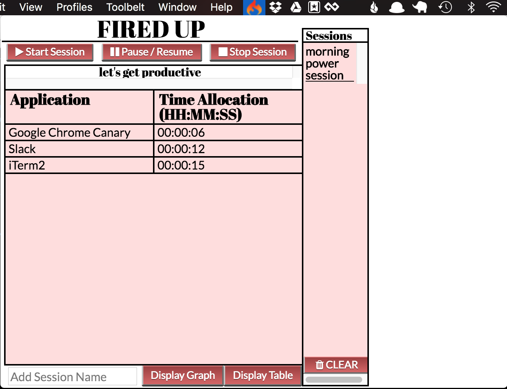

##Fired Up: A Productivity App

*Created by Ian Lancaster, Alex Pilewski, and Graham Nessler.*

This is a productivity application built with [Electron](http://electron.atom.io/). It consists of a menu icon that expands into a small window where the user can monitor his or her usage of desktop applications to track and improve productivity. For instance, the app can help you see if you use an "unproductive" app such as iTunes too often.

The interface includes the following options:

* Name input: Add a name for a new session. Each session name must be unique.
* Start Session: Begins a new session. You must enter in a name for the session first.
* Pause/Resume: Temporarily halts an ongoing session. To resume, you must press Pause again, not Start.
* Stop Session: Permanently terminates the current session. When this happens, the session's name will populate in the Sessions menu to the right. You can see past session info by clicking on the session name here.
* Display Graph: Shows session data as a graph.
* Display Table: Shows session data as a table (the default behavior).
* Clear: Clears all saved sessions for storage. This cannot be undone.

The data in the center of the window displays the time allocated on each application as either a table or a graph (see above). Once you have stopped a session, you cannot restart it, but you can review data from prior sessions.

In future versions, we hope to add features such as being able to rate each app based on its productivity value (or lack thereof), and display session data accordingly.

To use in development mode:

* Clone down this repo.
* `npm install.`
* Run `electron .` or `npm start` to run the application.

Tested for macOS Sierra and Ubuntu 16.04. 
